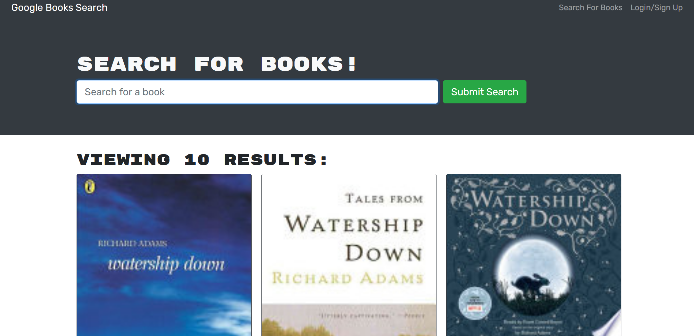

# Book-Search-Engine

## Table of Contents

- [Pictures](#pictures)
- [Description](#description)
- [License](#license)
- [Installation](#installation)
- [Usage](#usage)

## Pictures

## Description

This is a full-stack web application with which a user can search for books and add or remove tham from their collection.

## License

None

## Installation

The application can be used by anyone with the URL, or by forking the repository and duplicating it.

## Usage

Starting at the homepage, a user can search for any book. If they sign up or log in, they can then view their personal collection and modify it.

## Deployed Application
Not yet deployed

## For Questions
Email: rd.hart@outlook.com